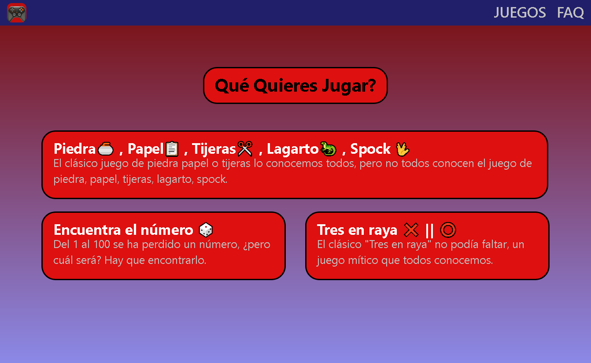
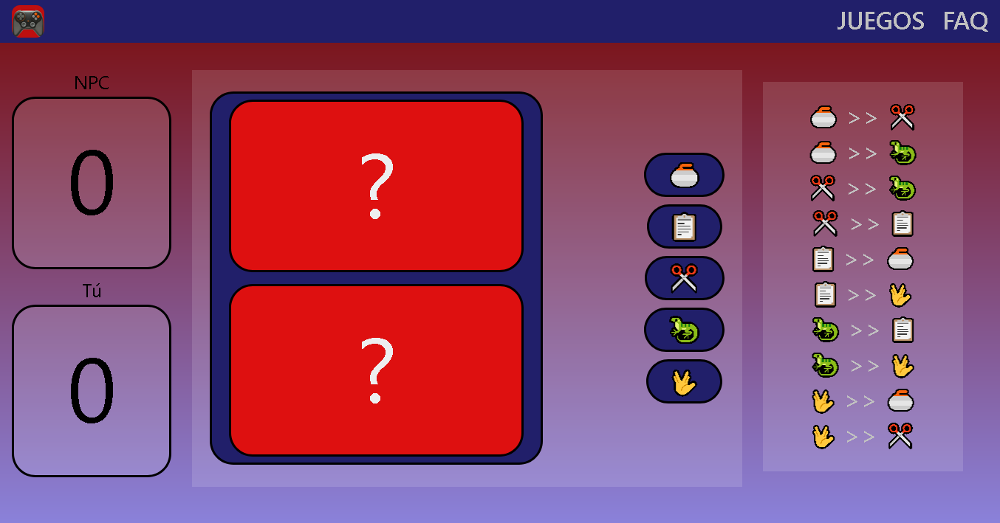

# MiniGames (Nombre mejorable)

---

## Tecnologias

**PYTHON :** Este es el único lenguaje en el que está programada toda la web, utilizando exclusivamente Python puro.

**Reflex :** Este es el framework que permite programar tanto la parte visual de la página (Front-end) como su lógica (Back-end).

---

## Caracteristicas

- **La página es completamente "Responsive".**
- **Utiliza exclusivamente el lenguaje Python para su funcionamiento.**
- **Está enfocada al público general.**

---

## Imagenes

### Pagina principal

### Piedra, Papel, Tijeras, Lagarto, Spock

---

## Link de interes

Si algo de esta web te ha parecido interesante, es probable que alguno de los siguientes enlaces también sea de tu interés:

**Pagina oficial de python:**[ https://www.python.org/](https://www.python.org/)
 
**Pagina oficial de reflex:**[ https://reflex.dev/](https://reflex.dev/)
 
**Link de la pagina web:**[ https://minigames.reflex.run/](https://minigames-with-reflex-git-main-jlopezsanty1-gmailcoms-projects.vercel.app/)
